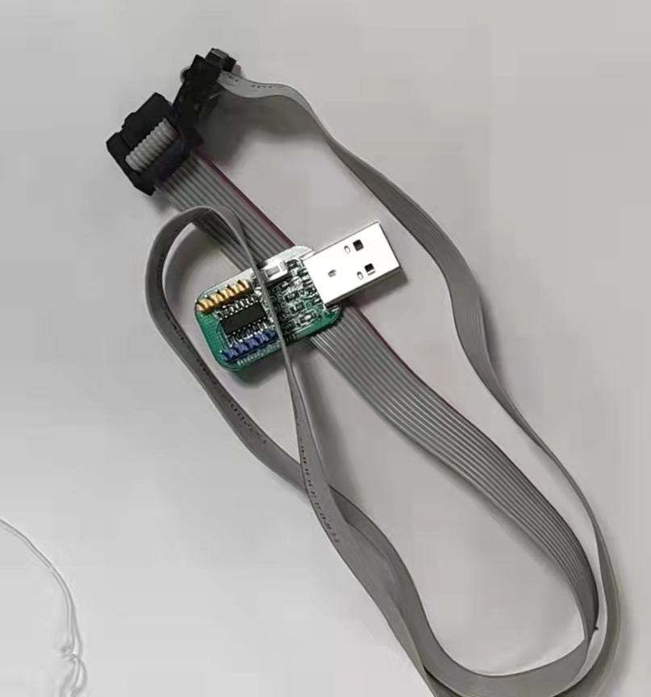
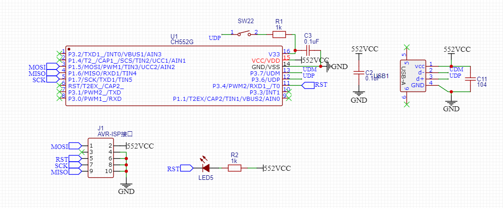
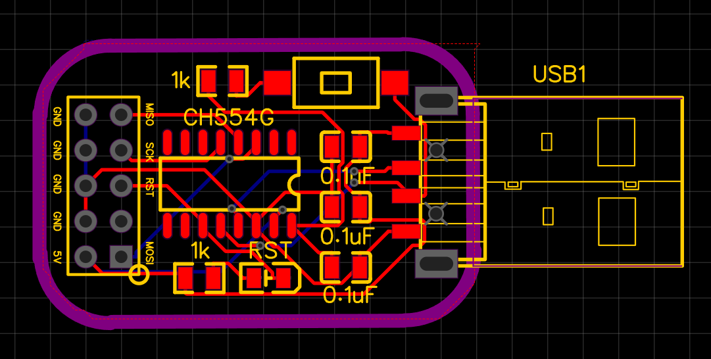
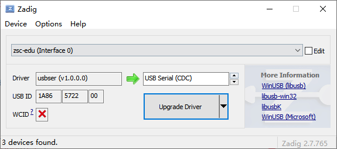
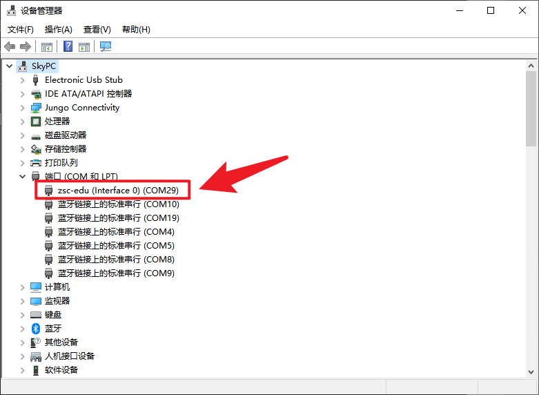
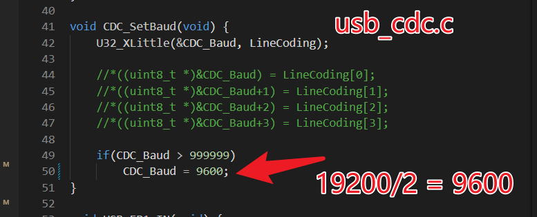

# CH554 USB AVR-ISP / Arduino as ISP

本工程该工程以
<https://github.com/rikka0w0/CH55x_USB_CDC>(该部分使用MIT协议)
为底层模板创建实现了USB虚拟串口，并结合
<https://github.com/DT9025A/STC8G-AVRISP>(该部分使用BSD协议)
的AVR-ISP项目，实现了基于CH554的虚拟USB AVR-ISP下载工具，默认波特率为19200

## 硬件

## 自定义USB虚拟串口设备名

请修改 ./usb_string_desc.c

并且为了可以正确在设备管理器中正确显示自定义的串口名，请使用Zadig软件替换驱动为USB Serial(CDC)

## 修改默认波特率

